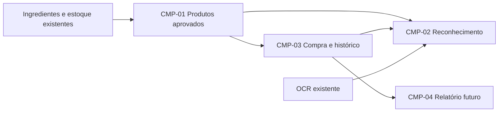

# Compras — primeiro incremento aprovado

Data: 07/10/2026. Fonte: [PRD](../../prd.md), extensão [Compras revisão 2](../compras-produtos-aprovados.md). CMP-01 a CMP-03 aprovados pelo usuário; CMP-04 futuro. Especificações/contratos consolidados na implementação. As seis fatias aprovadas foram implementadas e validadas em PostgreSQL descartável e UI desktop/390 px. [Relatório de implementação](implementacao-2026-10-07.md). Produção permanece sem alteração.

## Artefatos e autoridade

| Requisito | Comportamento | Interface | Execução |
|---|---|---|---|
| CMP-01 | [Produtos aprovados](cmp-01/spec.md) | [Cadastro e fornecedores](cmp-01/contract.md) | [Plano](cmp-01/plan.md) |
| CMP-02 | [Reconhecimento revisado](cmp-02/spec.md) | [OCR e resolução](cmp-02/contract.md) | [Plano](cmp-02/plan.md) |
| CMP-03 | [Compra e histórico](cmp-03/spec.md) | [Conversão, confirmação e consulta](cmp-03/contract.md) | [Plano](cmp-03/plan.md) |

[Qualidade e validação](qualidade.md) define gates e evidências. [Divisão em tickets](tickets-propostos.md) foi aceita e executada; arquivos locais em `.scratch/compras-produtos-aprovados/issues/`. Não são issues publicadas.

Produto é definido pelo PRD; comportamento verificável pela spec; campos e erros pelo contrato; sequência pelos planos. As rotas v2 e o catálogo estão disponíveis no código local; a implantação não foi realizada. A base observada foi HEAD `1db71ea99bcd3e598cc4276fc7b21d2d5a61d254` com alterações locais de administração e Markdown já existentes. Essas alterações não pertencem a esta rotina e devem ser preservadas.

## Decisões para implementação

- Reutilizar FastAPI, SQLAlchemy async, PostgreSQL/Alembic, Pydantic, Next.js e TanStack Query. Reconhecimento de vínculos confirmados é determinístico.
- Produto comercial pertence ao domínio Compras e aponta para Ingrediente do domínio Estoque. Não confundir com o cadastro de produtos vendáveis descrito em PROD-01.
- Marca e fabricante são atributos do produto no primeiro incremento; não exigir cadastros auxiliares antes da primeira compra. Fabricante desconhecido é null.
- Fornecedor é cadastro reutilizável da conta; aprovação é relação fornecedor/produto. Nome de loja sozinho não prova identidade.
- Embalagem é específica do produto; nunca alterar a conversão genérica de “un” do ingrediente para registrar uma barra.
- Novo fluxo web usa contratos v2 ao lado dos endpoints existentes. V1 permanece compatível até migração dos consumidores. WhatsApp passa pelo mesmo núcleo transacional, preservando seus comandos.
- Histórico imutável conserva fotografia comercial, quantidade fiscal, fator, quantidade de estoque e total efetivo. Não reconstruir compras antigas.
- Concluir CMP-02 exige integração com CMP-03. Não disponibilizar reconhecimento que salva estoque sem histórico.

## Ordem e integração

CMP-01 fornece produtos/fornecedores → CMP-03 fornece confirmação e histórico → CMP-02 integra leitura e aprendizado à confirmação. Essa ordem técnica não altera a prioridade conjunta aprovada. CMP-03 não depende do OCR para permitir uma compra manual demonstrável; CMP-02 consome sua confirmação sem duplicar regras.

Os contratos v2, catálogo, confirmação, persistência e consumidores foram integrados e verificados juntos. Não há ciclo de dependência; CMP-02 fornece uma descrição candidata ao núcleo CMP-03, que não exige que tenha sido lida por OCR.

## Limites e pendências

Escopo suficiente para especificar: cadastro, compra manual/revisada, OCR web, aprendizado, histórico e compatibilidade WhatsApp. A variante real do exemplo precisa ser confirmada na operação pela confeiteira; os testes usam produto branco explicitamente confirmado. Essa confirmação de dados não bloqueia a implementação genérica.

Formato e período padrão de CMP-04, retenção da imagem e aprovação completa pelo WhatsApp são decisões futuras. Não há metas quantitativas de performance aprovadas. Gates funcionais usam resultados determinísticos; métricas de produto são acompanhamento.

A divisão de seis tickets foi aprovada e implementada conforme to-tickets. Não foi identificado tracker/triagem configurado nos arquivos inspecionados; documentação local continua sem configurar ferramenta externa.
