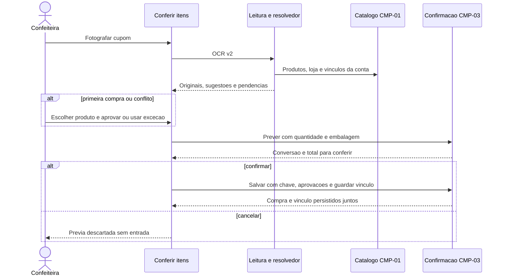

# CMP-02 — Reconhecimento revisado e aprendizado

Spec r2, 07/10/2026. Fonte [PRD Compras r2](../../compras-produtos-aprovados.md); [contrato](contract.md); [plano](plan.md). Produto aprovado; implementação local concluída.

## Evidências anteriores à implementação e escopo

Matching atual usa difflib e normalização contra nome do ingrediente, limiar 0,62, sem persistir a escolha. Tela muda a unidade para a sugerida e mantém quantidade/preço lidos; esse caminho precisa de prévia de conversão CMP-03. Adapter captura data, mas ComprasService não a retorna. OCR faz defaults para campos ilegíveis; o novo fluxo deve expor pendências em vez de tratá-los como fatos.

CMP-02 reaproveita leitura por foto e seleção de ingrediente existente; adiciona produtos comerciais e reconhecimento por vínculo confirmado. Não muda motor de receitas e não adiciona IA para classificação autônoma. Sem catálogo CMP-01 e confirmação CMP-03 reais, a feature não está integrada.

## Comportamento verificável

- C2-B1: primeira leitura sem evidência suficiente mantém item pendente de escolher material/produto, sem exigir novo ingrediente. Marca e fornecedor sozinhos não determinam variante.
- C2-B2: reconhecer, nesta ordem, identificador universal validado/confirmado, código confirmado da loja, descrição confirmada da loja; fallback textual apenas sugere material. Conflito em qualquer evidência leva à revisão, não ao candidato seguinte como se não houvesse conflito.
- C2-B3: descrição mantém variante e embalagem significativas. Exato admite apenas normalização de grafia/acentos/espaços/pontuação, preservando números; variações de peso/composição não colapsam.
- C2-B4: fornecedor desconhecido/ambíguo exige seleção. Alias de descrição/código não atravessa loja ou tenant; GTIN confirmado pode atravessar lojas dentro da mesma conta, com revisão de fornecedor pendente.
- C2-B5: usuário pode selecionar material existente, criar produto aprovado, aprovar loja na hora, fazer exceção, ignorar item e guardar vínculo. Cancelar não aprende; aprovação e aprendizado só persistem junto da compra em CMP-03.
- C2-B6: quantidade fiscal/valor/data lidos continuam separados da conversão de estoque. Dados desconhecidos são null e pendência; não adotar quantidade 1, custo 0 ou hoje como fato.
- C2-B7: inativar produto, mudar variante/embalagem ou revisão do vínculo invalida reconhecimento anterior. Correção conflitante exige escolha explícita e revisão atual, sem sobrescrever compra antiga.
- C2-B8: confiança OCR e score de similaridade não são prova de aprovação. Explicação visível informa “produto já confirmado nesta loja”, “identificador confirmado” ou “sugestão para conferir”.

## Casos de borda e cobertura

| Caso | Entrada/estado | Resultado | Trace/seam |
|---|---|---|---|
| C2-E1 | Cobertura Dr. Oetker sem “branco” e sem vínculo | Não selecionar branco por marca | C2-B1/B8; QA-01/05 |
| C2-E2 | Mesmo texto/loja após compra confirmada | Produto/material/embalagem sugeridos; nenhuma escrita na leitura | C2-B2/B5; QA-02 |
| C2-E3 | Mesmo texto, outra loja sem GTIN confirmado | Novo vínculo exige revisão | C2-B4; QA-05 |
| C2-E4 | Duas variantes com score empatado | Nenhum vencedor arbitrário; escolher | C2-B1/B2; QA-05 |
| C2-E5 | Número isolado no cupom coincide com GTIN | Código de loja permanece local até confirmação de natureza universal | C2-B2/B4; QA-05 |
| C2-E6 | “1,01KG” versus “1,05KG” | Não usar alias da embalagem diferente | C2-B3/B7; QA-04 |
| C2-E7 | Código conhecido, variante textual contraditória | Conflito e revisão, não salvar automaticamente | C2-B2/B7; QA-05 |
| C2-E8 | Loja igual por nome, dois IDs | Seleção explícita; sem mesclar | C2-B4; QA-12 |
| C2-E9 | Data ilegível, quantidade/preço ausentes | null e revisão obrigatória do item; não substituir silenciosamente | C2-B6; QA-12 |
| C2-E10 | Ignorar/cancelar/compra excepcional | Sem vínculo aprendido ou aprovação indevida | C2-B5; QA-06 |
| C2-E11 | Produto/alias editado após OCR | Confirmar devolve 409/404 e preserva formulário | C2-B7; QA-11 |
| C2-E12 | Imagem vazia/>8 MB/MIME inválido/OCR indisponível | Erro com revisão recuperável; nada gravado | C2-B6; QA-07 |
| C2-E13 | Produto alheio muito semelhante | Não sugerir nem listar; controle positivo próprio funciona | C2-B4; QA-10 |
| C2-E14 | Pontuação/caixa/acento divergentes | Vínculo reconhecido só quando variante/conteúdo permanecem iguais | C2-B3; QA-02 |
| C2-E15 | GTIN e código de loja apontam para produtos diferentes | Conflito explícito, sem desempate por prioridade | C2-B2; QA-05 |
| C2-E16 | Fotografia mock de demonstração | Fonte visível; WhatsApp mantém rejeição de mock; nenhum aprendizado automático | C2-B5/B8; QA-13 |

Os dez critérios de CMP-02 do PRD são refinados por C2-B1 a B8. Processamento síncrono da foto continua dentro da rota existente; fila nova/ordenação de jobs não é necessária. Timeout permite repetir leitura sem efeitos; retry de confirmação pertence a CMP-03.

## Decisões técnicas

Adicionar aliases_compra tenant-scoped por fornecedor + tipo de chave + valor normalizado, com produto_id, revisão do produto no aprendizado e revisão do vínculo. A unicidade ativa deve impedir duas classificações silenciosas da mesma chave dentro da loja. Deletar é soft; conflitos retornam 409, sem “última gravação vence”.

Normalização determinística conservadora separada de score_similaridade atual. Equivalência de “1,01 kg” e “1.01 kg” só é segura quando parser de conteúdo confirma mesma medida; caso contrário, pedir revisão. Não eliminar marcas, cores, percentuais ou tamanhos para criar alias exato.

Código lido sem tipo universal confirmado é codigo_loja. GTIN validado no catálogo e leitura confirmada como universal são necessários para alcance entre lojas. Prompts extraem informação e ausências; regras de aprovação/vínculo ficam fora do modelo de IA.

Ampliar o adapter com metadados opcionais e informação explícita de campos ilegíveis; consumir valores numéricos como Decimal a partir do JSON original. Atualizar consumidores v1/WhatsApp na mesma evolução para evitar defaults que escondam ausência ou mudança inadvertida de unidade. Não fazer chamada externa adicional ao trocar fornecedor na revisão.

## Regressão e integração

Aplicar [QA/gates](../qualidade.md); usar FakeOCR de contrato e catálogo/compra reais. Fixture do exemplo indica branco somente depois da escolha explícita, não como campo inventado pelo OCR. Confirmar QA-01 → QA-02 em sequência, sem novo material; testar variantes, isolamento e pendências.

CMP-02 consome [CMP-01](../cmp-01/contract.md) e [CMP-03](../cmp-03/contract.md). Não duplicar conversão, preço ou transação na UI. Migration de alias é aditiva; sem aprender a partir de nomes antigos automaticamente. Spec preparada para tickets; provider/consumers novos ainda não implementados.

## Evidência de implementação

Implementação local integrada em 07/10/2026. [Relatório, arquivos e validações](../implementacao-2026-10-07.md). Não houve commit, publicação, migração de produção ou deploy.
