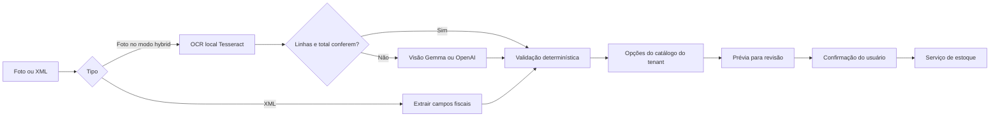

# OCR híbrido e decisões — situação em 06/10/2026

Implementação publicada na VPS Fornada em 06/10/2026, revisão `bae8bfa`, no modo híbrido com Gemma 4. Backend, frontend, proxy e worker foram atualizados; banco e integração Evolution foram preservados. Ver [evidências do deploy](deploy-ocr-2026-10-06.md).

| Componente | Situação |
| --- | --- |
| Evolution, sessão fornada, webhook e worker | Ativados em produção anteriormente |
| Cadastro guiado, onboarding e compras manuais | Implementados e habilitados; conversa real ainda precisa ser validada pelo operador |
| Compras por foto, revisão e confirmação única | Habilitadas; inferência real validada com cupom sintético, conversa real pendente |
| Extração direta de XML NF-e/NFC-e pelo aplicativo | Implementada nesta entrega, sem IA |
| OCR local Tesseract e fallback de visão | Publicados e ativos: hybrid + gemma |
| Extração OpenAI com Responses API e Structured Outputs | Adapter implementado e contrato testado com HTTP fake; falta chave, modelo e avaliação real |
| Validação de quantidade, preço e total da linha | Implementada com Decimal; campo ilegível não vira quantidade 1 ou preço zero |
| Conferência do total do cupom | Avisos de divergência/total ausente exibidos na revisão do aplicativo e na primeira prévia WhatsApp |
| Decisões sobre vínculo de ingredientes | Porta substituível; implementação local com abstenção em empates e validação das opções do tenant |
| Jev / OpenAI Decisions API | Integrações externas ainda pendentes; nenhum endpoint inventado ou chamado |
| Consulta fiscal por QR Code | Pendente; requer leitura do QR, destinos oficiais permitidos e tratamento por SEFAZ |
| XML anexado no WhatsApp | Pendente; o transporte atual aceita imagens e texto, não documentMessage |

## Fluxo implementado



O parser textual é conservador: reconhece linhas com descrição, quantidade, unidade, multiplicador, preço unitário e total. Só evita a chamada de visão quando há um total único reconciliado. Layouts diferentes, OCR local ausente/erro ou leitura parcial usam a extração de visão completa, sem juntar itens parciais. O Dockerfile de produção instala Tesseract e o idioma português. Em Windows, instalar o binário separadamente ou usar a imagem Docker.

Campos essenciais ausentes, valores negativos/não finitos e inconsistência de uma linha bloqueiam a prévia e pedem nova foto ou entrada manual. Divergência entre soma e total gera aviso: descontos, frete e acréscimos não são rateados automaticamente. O usuário deve corrigir os custos antes de confirmar. Os avisos não representam uma validação fiscal ou garantia de completude. Confiança da extração é `null` quando não medida; o score de similaridade do catálogo é um sinal distinto.

XML é dado fornecido pelo usuário: o parser rejeita DTD/entidades e formatos fora de NF-e/NFC-e, mas não valida assinatura, autorização SEFAZ, destinatário ou unicidade da chave fiscal. Importar não comprova autenticidade nem impede importar novamente o mesmo documento. Não busca URLs externas. Somente a confirmação grava estoque.

## Configuração

Modelo definido para o fallback Google: `gemma-4-26b-a4b-it`, temperatura `0.1` e thinking `minimal`. Backend e worker recebem `GEMMA_OCR_MODEL`, `GEMMA_OCR_TEMPERATURE` e `GEMMA_OCR_THINKING_LEVEL` pelo Compose. O SDK envia `thinkingLevel=MINIMAL` e `includeThoughts=false`; os testes verificam a chamada. Referência do Google: [configuração MINIMAL para Gemma 4](https://discuss.ai.google.dev/t/disable-thinking-for-gemma-4/138885/6).

Para esta publicação, usar `OCR_PROVIDER=hybrid` e `OCR_VISION_PROVIDER=gemma`. A ausência de `GOOGLE_AI_API_KEY` impede o fallback remoto; não impede a importação XML nem o OCR local quando o cupom é reconhecido e reconciliado. Não há confirmação de inferência real do modelo sem essa credencial.

O padrão permanece `OCR_PROVIDER=gemma`, preservando a configuração anterior. Para híbrido com visão OpenAI, configure backend e worker:

```dotenv
OCR_PROVIDER=hybrid
OCR_VISION_PROVIDER=openai
OPENAI_API_KEY=<somente no ambiente remoto restrito>
OPENAI_OCR_MODEL=<modelo com visão e Structured Outputs disponível na conta>
```

Não há modelo OpenAI escolhido implicitamente. `OCR_PROVIDER=openai` pula o OCR local; `OCR_VISION_PROVIDER=gemma` usa `GOOGLE_AI_API_KEY` no fallback. XML não precisa de chave de IA. A Responses API é usada para extração; ela não equivale à Decisions API. Nenhum segredo pode ser enviado ao frontend ou versionado. Fotos são transmitidas apenas ao provedor configurado quando o OCR local não basta. `store=false` é enviado à OpenAI; não significa, sozinho, Zero Data Retention.

## TypeSafe e próximos passos

A skill [typesafe-ai](https://github.com/typesafe-ai/skills/blob/main/skills/typesafe-ai/SKILL.md) foi instalada para Codex usando unicamente `npx skills add`. Foram consultados os documentos oficiais de [Choice](https://docs.typesafe.ai/primitives/choice), [HTTP API](https://docs.typesafe.ai/api), [confiança](https://docs.typesafe.ai/confidence) e [alinhamento de entidades](https://docs.typesafe.ai/cookbooks/entity_alignment).

Aplicação das orientações: cálculos e execução ficam em código; decisões são restritas aos candidatos enviados e podem abster-se; IDs fora dessas opções nunca viram vínculos. O provider atual é local e não produz probabilidades Jev. O limiar de similaridade e a margem de ambiguidade são heurísticas, não calibração.

Para conectar Jev, implementar o provider com Choice incluindo “nenhum corresponde”, preservar probabilidades/confiança e agrupar perguntas independentes em uma chamada. Avaliar cobertura dos candidatos: a porta atual usa shortlist de cinco ingredientes; não deve ser assumida suficiente para abreviações. Calibrar os critérios com cupons reais e tratar falha do fornecedor/baixa confiança com revisão. A Decisions API OpenAI depende de acesso e contrato público confirmado.

Antes de publicar: configurar credenciais/modelo, testar cupons brasileiros de layouts variados (descontos, quantidade fracionada, embalagens, fotos ruins), medir latência/custo/precisão e consumo na VPS de 1 GB. As imagens são construídas fora da VPS; o deploy usa o modo public-micro. A publicação desta implementação foi autorizada em 06/10/2026.

## Validação local

Passaram 196 testes de unidade e integração de compras/WhatsApp com PostgreSQL descartável, incluindo upload XML e verificação dos parâmetros enviados ao Gemma. Passaram também os 34 testes frontend, Ruff, TypeScript e `git diff --check`.

A imagem Docker de produção foi construída localmente. Dentro dela, sem rede, o Tesseract extraiu um item e o total de R$ 11,80 de uma imagem sintética, sem acionar visão. Isso confirma a instalação e o caminho local, mas não mede a precisão em cupons reais. O banco temporário foi removido. A publicação deve ser conferida pelo registro operacional do deploy, incluindo revisão, imagens e saúde dos serviços.

Fontes OpenAI: [visão](https://developers.openai.com/api/docs/guides/images-vision) e [Structured Outputs](https://developers.openai.com/api/docs/guides/structured-outputs).
